# rust-bundler

Creates a single-source-file version of a Cargo package.

[](https://travis-ci.org/slava-sh/rust-bundler)
[](https://codecov.io/gh/slava-sh/rust-bundler)
[](https://crates.io/crates/bundler)

## Features

* Replaces `extern crate my_lib;` in `main.rs` with the contents of `lib.rs`.
* Expands `mod my_mod;` declarations into `mod my_mod { ... }` blocks.

## Example

Input:
```rust
// src/internal.rs:
pub fn hello_world() {
    println!("Hello, world!");
}

// src/lib.rs:
mod internal;
pub use internal::hello_world;

// src/main.rs:
extern crate example;
fn main() {
    example::hello_world();
}
```

Output:
```rust
mod internal {
    pub fn hello_world() {
        println!("Hello, world!");
    }
}
pub use internal::hello_world;
fn main() {
    hello_world();
}
```

More examples in [tests/testdata](https://github.com/slava-sh/rust-bundler/tree/master/tests/testdata).

## Usage

Install:
```sh
$ cargo install bundler
```

Run:
```sh
$ bundle path/to/project >output.rs
```

## Library Usage

```toml
[dependencies]
bundler = "0.1"
```

```rust
extern crate bundler;

fn main() {
    let code = bundler::bundle("path/to/project");
    println!("{}", code);
}
```

## Project Overview

Diagram of the project structure:

```mermaid
classDiagram
    %% Core domain traits and interfaces
    class FileDiscovery {
        <<trait>>
        +find_rust_files(path: &Path) Result~Vec~PathBuf~~
    }
    
    class CodeParser {
        <<trait>>
        +parse(content: &str) Result~SyntaxTree~
        +remove_unwanted_elements(tree: &mut SyntaxTree) Result~()~
    }
    
    class CodeMinifier {
        <<trait>>
        +minify(tree: &SyntaxTree) Result~String~
        +compress_to_single_line(code: &str) Result~String~
    }
    
    class FileProcessor {
        <<trait>>
        +read_file(path: &Path) Result~String~
        +write_file(path: &Path, content: &str) Result~()~
    }
    
    class ErrorReporter {
        <<trait>>
        +report_error(error: &ProcessingError)
        +format_error_message(error: &ProcessingError) String
    }

    %% Main application orchestrator
    class RustSingler {
        -file_discovery: Box~dyn FileDiscovery~
        -code_parser: Box~dyn CodeParser~
        -code_minifier: Box~dyn CodeMinifier~
        -file_processor: Box~dyn FileProcessor~
        -error_reporter: Box~dyn ErrorReporter~
        +new(dependencies...) Self
        +compress_directory(input_path: &Path, output_path: &Path) Result~()~
        +compress_file(input_file: &Path, output_file: &Path) Result~()~
        -process_single_file(file_path: &Path) Result~String~
    }

    %% Concrete implementations
    class RecursiveFileDiscovery {
        +find_rust_files(path: &Path) Result~Vec~PathBuf~~
        -is_rust_file(path: &Path) bool
        -should_skip_directory(path: &Path) bool
    }
    
    class SynCodeParser {
        +parse(content: &str) Result~SyntaxTree~
        +remove_unwanted_elements(tree: &mut SyntaxTree) Result~()~
        -remove_comments(tree: &mut SyntaxTree)
        -remove_test_code(tree: &mut SyntaxTree)
        -remove_doc_comments(tree: &mut SyntaxTree)
        -remove_cfg_test_attributes(tree: &mut SyntaxTree)
    }
    
    class WhitespaceMinifier {
        +minify(tree: &SyntaxTree) Result~String~
        +compress_to_single_line(code: &str) Result~String~
        -preserve_string_literals(code: &str) Result~String~
        -remove_unnecessary_whitespace(code: &str) String
    }
    
    class StandardFileProcessor {
        +read_file(path: &Path) Result~String~
        +write_file(path: &Path, content: &str) Result~()~
        -ensure_output_directory(path: &Path) Result~()~
    }
    
    class ConsoleErrorReporter {
        +report_error(error: &ProcessingError)
        +format_error_message(error: &ProcessingError) String
        -format_with_colors(message: &str) String
    }

    %% Value objects and data structures
    class SyntaxTree {
        -items: Vec~Item~
        -span: Span
        +new() Self
        +add_item(item: Item)
        +remove_item(index: usize)
        +to_token_stream() TokenStream
    }
    
    class ProcessingError {
        <<enumeration>>
        FileNotFound(PathBuf)
        ParseError(String)
        IoError(std::io::Error)
        CompressionError(String)
    }
    
    class CompressionConfig {
        +preserve_string_formatting: bool
        +remove_doc_comments: bool
        +remove_test_code: bool
        +output_single_line: bool
        +new() Self
        +default() Self
    }

    %% CLI layer
    class CliApplication {
        -rust_singler: RustSingler
        +new() Self
        +run(args: CliArgs) Result~()~
        -parse_arguments() CliArgs
        -validate_arguments(args: &CliArgs) Result~()~
    }
    
    class CliArgs {
        +input_path: PathBuf
        +output_path: PathBuf
        +config: CompressionConfig
        +verbose: bool
    }

    %% Performance monitoring
    class PerformanceTracker {
        <<trait>>
        +start_timer(operation: &str)
        +end_timer(operation: &str)
        +report_metrics()
    }
    
    class MetricsCollector {
        -timers: HashMap~String, Instant~
        -metrics: HashMap~String, Duration~
        +start_timer(operation: &str)
        +end_timer(operation: &str)
        +report_metrics()
        +get_total_processing_time() Duration
    }

    %% Relationships
    RustSingler --> FileDiscovery : uses
    RustSingler --> CodeParser : uses
    RustSingler --> CodeMinifier : uses
    RustSingler --> FileProcessor : uses
    RustSingler --> ErrorReporter : uses
    
    RecursiveFileDiscovery ..|> FileDiscovery : implements
    SynCodeParser ..|> CodeParser : implements
    WhitespaceMinifier ..|> CodeMinifier : implements
    StandardFileProcessor ..|> FileProcessor : implements
    ConsoleErrorReporter ..|> ErrorReporter : implements
    
    CliApplication --> RustSingler : owns
    CliApplication --> CliArgs : uses
    
    SynCodeParser --> SyntaxTree : creates/modifies
    WhitespaceMinifier --> SyntaxTree : reads
    
    RustSingler --> ProcessingError : handles
    RustSingler --> CompressionConfig : uses
    
    MetricsCollector ..|> PerformanceTracker : implements
    RustSingler --> PerformanceTracker : uses
```



## Similar Projects

* [lpenz/rust-sourcebundler](https://github.com/lpenz/rust-sourcebundler)
  is based on regular expressions, whereas this project manipulates the syntax tree
* [MarcosCosmos/cg-rust-bundler](https://github.com/MarcosCosmos/cg-rust-bundler)
* [golang.org/x/tools/cmd/bundle](https://godoc.org/golang.org/x/tools/cmd/bundle) for Go
